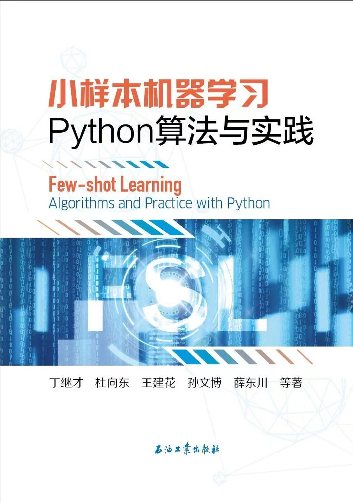
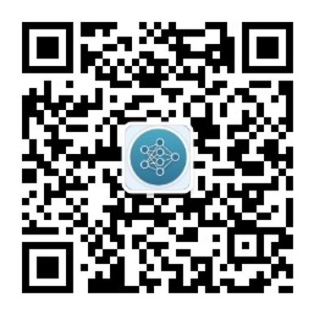

# Few-shot Learning Algorithms and Practice with Python

Digital edition of Learning Algorithms and Practice with Python

<!-- PROJECT SHIELDS -->

<!-- PROJECT LOGO -->

 

  

<h3 align="center">小样本机器学习Python算法与实践</h3>
  

    Few-shot Learning Algorithms and Practice with Python
     

本书纸质版由石油工业出版社出版

## 

- [书籍内容说明](#书籍内容说明)
- [环境配置建议](#环境配置建议)
- [如何较好的使用这本书](#如何较好的使用这本书)
- [作者的话](#作者的话)
- [购买纸质书籍途径](#购买纸质书籍途径)
- [新书预告](#新书预告)

### 书籍内容说明

- 第1章 小样本问题与机器学习综述
  
&nbsp;&nbsp;&nbsp;&nbsp;&nbsp;&nbsp;&nbsp;&nbsp;&nbsp;&nbsp;&nbsp;&nbsp;数据、模型和算法三个维度阐述小样本问题总体解决思路；Tensorflow、Pytorch、PaddlePaddle和Scikit-learn等机器学习范式和示例。

- 第2章 数据预处理和分析
  
&nbsp;&nbsp;&nbsp;&nbsp;&nbsp;&nbsp;&nbsp;&nbsp;&nbsp;&nbsp;&nbsp;&nbsp;机器学习坚持“数据为王”的理念，包括数据预处理（归一化、标准化、数据清洗和数据编码）、特征提取和转换（图像特征提取、傅里叶变换和信号稀疏表示）、数据降维和数据聚类（降维算法、特征选择和特征溯源）。

- 第3章 数据增强
  
&nbsp;&nbsp;&nbsp;&nbsp;&nbsp;&nbsp;&nbsp;&nbsp;&nbsp;&nbsp;&nbsp;&nbsp;传统数据增强(Smote、SamplePairing和Mixup)；基于深度学习的数据增强(变分自编码器VAE、生成对抗网络GAN、流模型NF和扩散模型Diffusion Model)。

- 第4章 传统机器学习算法
  
&nbsp;&nbsp;&nbsp;&nbsp;&nbsp;&nbsp;&nbsp;&nbsp;&nbsp;&nbsp;&nbsp;&nbsp;单一算法(决策树、KNN、逻辑回归、支持向量机、朴素贝叶斯)；集成算法(装袋元评估器、随机森林)；提升法(Adaboost、Xgboost)。

- 第5章 不完全监督学习
  
&nbsp;&nbsp;&nbsp;&nbsp;&nbsp;&nbsp;&nbsp;&nbsp;&nbsp;&nbsp;&nbsp;&nbsp;主动学习；传统半监督(标签传播、伪标签方法)；基于深度学习的半监督(基于生成模型的半监督(半监督GANs和半监督VAE)、一致性约束方法、伪标签方法和综合方法)。

- 第6章 迁移学习
  
&nbsp;&nbsp;&nbsp;&nbsp;&nbsp;&nbsp;&nbsp;&nbsp;&nbsp;&nbsp;&nbsp;&nbsp;pre-training + fine-tuning迁移；语言大模型(LLM)；多任务学习(MTL)；多标签学习(MLL)。

- 第7章 元学习
  
&nbsp;&nbsp;&nbsp;&nbsp;&nbsp;&nbsp;&nbsp;&nbsp;&nbsp;&nbsp;&nbsp;&nbsp;借助百度公司的PaddleFSL算法包主要介绍了基于度量的元学习算法(孪生神经网络模型、匹配网络、原型网络和关系网络)；基于优化的元学习算法(MAML和Reptile)。

### 环境配置建议

1. tensorflow   2.5.0
2. pytorch      1.11.0
3. Paddlepaddle 2.3.2
4. Scikit-learn 1.0.2

### 如何较好的使用这本书
本书不仅仅是一本专门用来解决小样本机器学习问题的专用书籍，同时是一本信号分析（特征工程、信息挖掘）、传统机器学习和深度学习的参考书。

（1）信号分析（特征工程、信息挖掘）

依次阅读以下章节：1章1.2节、4章、2章、按需选择5-7章中相关内容。

（2）传统机器学习

依次阅读以下章节：1章1.2节、3章3.1节、4章、2章、按需选择5-7章中相关内容。

（3）深度学习

依次阅读以下章节：1章1.2节、2章、3章3.2节、按需选择5-7章中相关内容。

（4）小样本机器学习

依次阅读1章至4章、按需选择5-7章中相关内容。

### 作者的话

深度学习带动下，人工智能迅速发展，但在很多垂直领域（如笔者从事的能源领域），总感觉“热闹是他们的，我什么也没有”(朱自清的散文《荷塘月色》)。数据、场景、算力、算法“四位一体”是人工智能成熟的必备因素。但很多垂直领域开展人工智能研究首先面临着标注数据不足的问题。小样本问题首先是数据问题，其次是算法问题。针对小样本开展机器学习研究是本书的主要目标。

在写书过程中拜读了许多国内外人工智能工作者文章和书籍，受益匪浅，对人工智能科研工作者同行深表感谢。

在写书过程中，参阅了很多人工智能大神们在github、博客、知乎、百度文库、简书等媒介上的文章和代码，深受启发。

在机器学习研究过程中，还从很多优秀的网络课程上获得给养，如吴恩达老师、台大教授李宏毅老师、菜菜TsaiTsai 老师等机器学习课程，课程精彩绝伦，对本书的很多内容起到了不可替代的作用。

作为人工智能大家庭中的普通一员，出版本书仅仅是想为人工智能的发展贡献一份微薄之力，如果有侵犯版权等问题出现，请第一时间联系作者，在此深表歉意，并在后续出版过程中进行修正。

本书配套数据、图片和模型较大，未能放置在github，获取方法：关注公众号（AI行在路上）发送消息“小样本”自动获得下载连接。

 

  
<h4 align="center">更多内容请关注公众号：AI行在路上</h4>

### 购买纸质书籍途径
- 京东直接搜索书名《小样本机器学习Python算法与实践》
- 石油工业出版社京东自营官方旗舰店
https://mall.jd.com/index-1000104184.html
- 京东商城中油书店图书专营店
https://mall.jd.com/index-692504.html

### 新书预告
作者计划2024年年底前出版一本深度学习专著（书名初步定为《大道至简：深度学习那些事》），目的是使得读者可以快速入门深度学习，掌握原理并上手实践。敬请期待。

该书特点：

（1）由简到繁循序渐进多维度阐述深度学习；

（2）部分代码利用动画演示，更直观；

（3）提供了部分数理知识和公式推导供查阅；

（4）书中全部代码及数据对读者公开。

